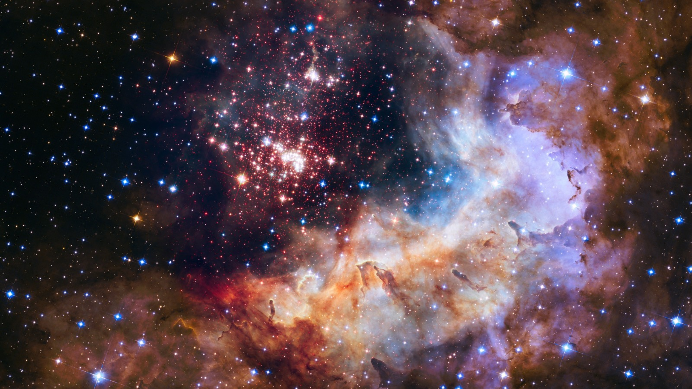
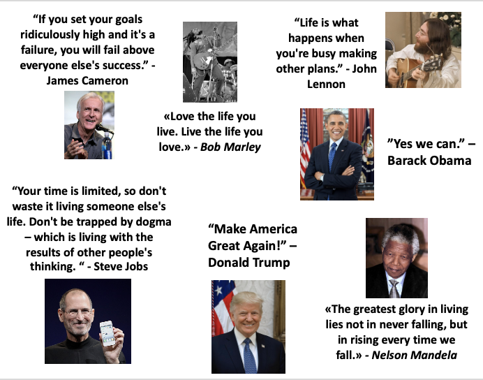
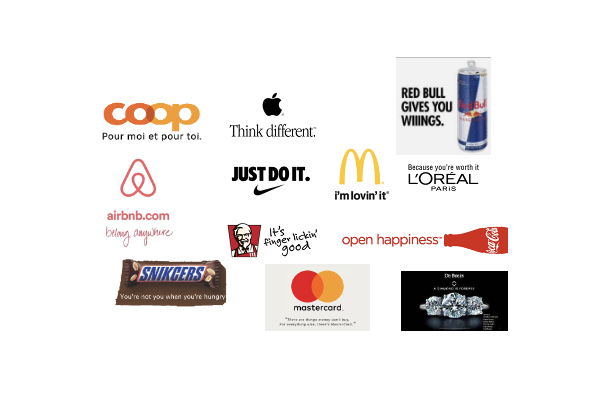
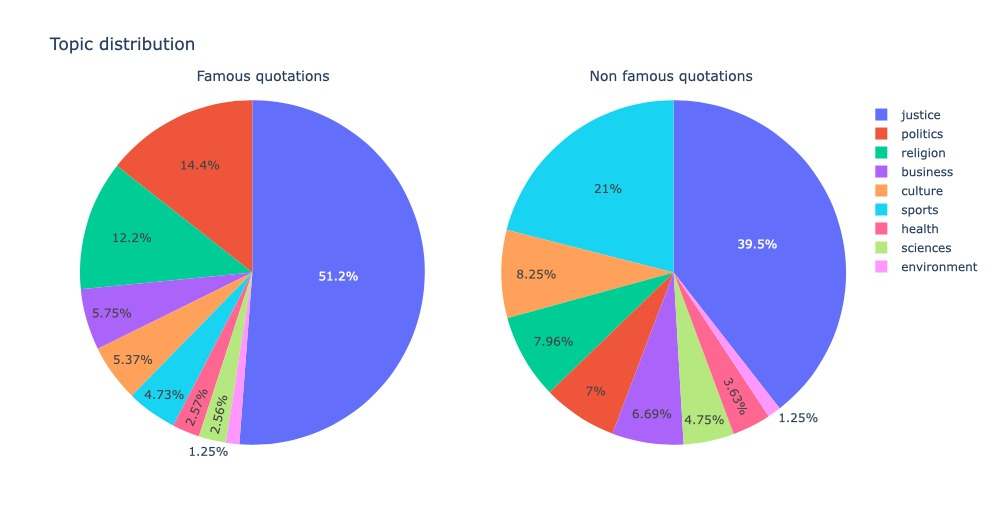
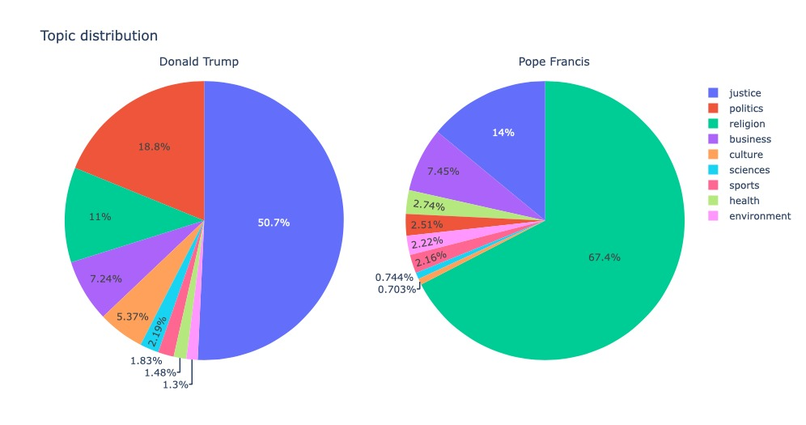

> # “Shoot for the moon. Even if you miss, you'll land among the stars.” Norman Vincent Peale

Did you ever dream of your words like the ones of Shakespeare, Einstein or Trump remaining forever etched in the memory of humanity? Would you like to be famous? Then this website might help you!

First, try to write something, we’ll tell you if your words will become famous:



Anyway you better try our famous quote generator if you want to succeed, 100% chance of success. Click on the button and here we go:
** WIDGET (quote generator)**

  
   

   <button id="Click Me" href="#" onClick="img(); text()">Click me to get a chance to be famous</button>
 
	

		
		
		

	

        
        

Inspiring no? Post it right away on twitter or instagram and let the magic happen...
(What? nonsense you’re saying? I think that you are just not ready for that new vision on syntax)

 
** While you are waiting for the fame to come thanks to your quote, you can explore the data and read more about what makes a quote famous. **

  
   

I would bet these slogan ring a bell to you! Those quotes emitted by famous personnalities remain in your mind and are cited over again, but why ? Whats makes the fame of those quotes. This is the million dollar question. 

"A brand is a voice and a product is a souvenir."- Lisa Gansky
Consumers use products, but the brand is what speaks to them. One recent exemple is Dacia with its "Everybody drives a duster.", that advertisement for sure caught your attention, perhaps you even sang, as compared to other car advertisements that were left unoticed. 

Mediatized people often want to make the buzz, in order to create their own brand and remain famous. A precident has also a slogan during its compaign, and it should be short, appealing and stick in your head. It is of high interest to generate a famous that will be cited multiple times.

So what makes the fame of a quote ? Does it depend on the speaker, on the content, or on the length of a quote ? Through this website, you will fit the shoes of a data analysis to discover what parameters define the fame of a quote.

## Data

The data at our disposition was the corpus of Quotebank containing citations extracted from newspapers over the years 2008 to 2020. If you are interested on the methods used to extract quotes, and attribute it to speakers, have a look at the [paper](https://dlab.epfl.ch/people/west/pub/Vaucher-Spitz-Catasta-West_WSDM-21.pdf). You can also use this related [tool](https://quotebank.dlab.tools) that allows you to enter a keyword and it will search the database for related quotes and show you its occurrence over time.

Using this set of quotes (2015-2020), we selected only the 1% of the most famous quotes with more than 215 occurrences, and also sampled randomly quotes with less than 10 occurrences to be considered as non-famous. With this set of quotes we aim at analyzing what makes a quote famous or what makes it fall into neglect. In order to be able to compare those sets on quotes features (polarity, complexity of a sentence, etc.) and speakers features (occupation, nationality etc.), we decided to remove quotes without attributed speaker and keep only famous speakers. This avoid artifacts of quotes being often cited bcause of differences in fame among speakers that we cannot account for. Therefore, we selected famous and non-famous quotes from speakers appearing in the [Pantheon database](Yu, A. Z., et al. (2016). Pantheon 1.0, a manually verified dataset of globally famous biographies. Scientific Data 2:150075. doi: 10.1038/sdata.2015.75)). It was generated on the base of wikipedia bibliographies views, the number of different wikipedia languages, the coefficient of variation etc. and it combines those values in a single metrics, the historical popularity index (HPI).

So, let us now dive into the data and see if we can figure out what contributes to a quote being cited several times.

### What are the trends ?

First, you can have a glimpse at the number of different quotes emitted by the top 20 of people emitting the most famous quotes over time, as well as the quote with the most occurrences.



Unsurprisingly we see Donald Trump in the first place ! He is even indirectly mentionned in the most famous quote of Pope Francis “A person who thinks only about building walls …”. It is also very interesting to see that politicians emitted the largest number of famous quotes, as they are highly mediatized and all their words are reported and analyzed in newspapers.

Let's look now at the dynamics over time. The figure below shows the number of famous quotes emitted over time (2015-2020) by the top 20 of the previous speakers. You can slide your cursor over the peaks to see the quote with the most citations at a specific date, you can zoom in, and also deselect some speakers.



It is very interesting to see the different peaks and how they relate to highly mediatized events in English newspapers. 
* The peak in September 2016 of Donald Trump is during its presidential compaign were he “unleashes a blizzard of falsehoods, exaggerations and outright lies in the general election, peppering his speeches, interviews and Twitter posts with untruths so frequent that they can seem flighty or random — even compulsive.” 
* The peak of quotations in June 2017 of James Comey, former FBI director, coincides with its testimony after being fired by Donald Trump, and with Jeff Sessions peak, who originally recommended Trump about this firing. 
* Pope Francis visits Washington and New York City on the 24th of September 2015, which explains the quotations in newspapers, and on February 2016 he pronounces a powerful sentence about the American President “A person who thinks only about building walls -- wherever they may be -- and not building bridges, is not Christian ... ”
* The peak in April 2018 of Emmanuel Macron correspond to its speech to the Congress of the United States of America. 

You may already have realized that most of the quotations we collected from Quotebank are largely related to events mediatized in American newspapers. Here, below you can observe the proportion of famous quotes and non-famous quotes according to the speakers origin.



### The bets are open
                                                             
Now it is your turn to take guesses on what makes the fame of a quote by selecting some parameters and see their distribution across famous and ‘non-famous’ quotes. You can see parameters at the speakers level, as well as at the quote level. Indeed, using [TextBlob](https://pypi.org/project/textblob/0.9.0/) a natural language processing (NLP) library we defined the polarity and subjectivity of a quote. Polarity scores were calculated on the quotes and range from -1 (negative) to 1 (positive), with 0 representing neutral quotes. Subjectivity scores range from 0 to 1 and we consider subjective quotes with a score above 0.5. 
So, which individual features do you predict can differentiate famous from non-famous quotes ?



Also, you may want to consider combining some features. What do you observe ?



Perhaps you are wondering, what are the quotes about ? You may have already guessed that most famous quotations over time are related to politics, but justice also appears frequently, a bit less lkely are arts and environment. Quotes were tagged using [Empath](https://arxiv.org/pdf/1602.06979.pdf), a tool that can generate and validate new lexical categories on demand from a small set of seed terms,which where manually defined based on Macmillan Thesaurus.



Would you expecte a difference in topics between famous and non-famous quotes ? If yes which topics would be more or less prominent ?

 

Both types of quotes have a high percentage of quotes related to justice. Sports represents 21% of non-famous quotes, whereas it only makes up for 4.73% of famous quotes seems. Politics is in contrast twice much more present in famous quotes compared to non-famous.

It is also interesting the distribution of topics among famous speakers.

 

**Du coup à enlever ?**


### Predict fame

You may have already developed an intuition that most famous quotes are emitted by politicians in North America, covering mostly politics or justice. 



Would you want to consider to some additional parameters to predict the fame of a quote? 

**Did you think about the importance of words ? What words would you expect to see based on previous observations ?**


In the plot below you can slide over the plot with your cursor to see the most used words in famous versus non-famous quotes. There are a lot of similarities in the highly frequent words, such as the use of ‘people’, ‘going’, ‘think’, etc. But some frequent words are specific to the famous quotes: ‘us’, ‘president’, ‘country’, etc. as compared to ‘like’, ‘really’, ’time’ in non-famous quotes.
These relates to what you previously observed, in the majority of famous quotes are neutral, as comapred to most positive quotes in non-famous ones. Moreover, you saw the high proportion of politician speakers in both the famous and non-famous dataset, which also explains the occurence of some specific words.

We also considered several additional parameters such as:
* The length of a quote (the number of words, and characters)
* Whether a speaker was alive at the date of the citation.
* The historical popularity index (HPI) of a speaker.
* Grammatical features based on [Part-of-speech tags](https://spacy.io/usage/linguistic-features#pos-tagging) to quantify the number of adverbs, nouns, etc. that a quote contains. This allowed to attribute a complexity score to the quotation.
* Named Entity Recognition [(NER)](https://towardsdatascience.com/named-entity-recognition-with-nltk-and-spacy-8c4a7d88e7da) to identify the number of times a quote mentions a date, a person, an organization, an event, a language etc.

**Let see if your intuition is correct, and whether supervised learning methods agree with you ;)**

Using logistic regression and random forest as supervised learning classifiers, we were able to predict the fame of new quotes with an accuracy of 0.74 %. Here below, you can see which coefficients and its associated feature contributes the most to the prediction.





###Famous quote generator:
Some further explanation, about the quote generator you used at the top.

We selected a corpus of the 1000 most famous quotes across years, ranging from 98263 to 1028 occurrences. The text was preprocessed in order to remove punctuation and numbers as well as multiple spacing. An LSTM model was created and trained on 100 epoch using this corpus. The output of the model is the probability of the next word in the sequence. Once the model was trained, we generated new sentences using a random seed of 4 words and limiting its length to 13 words since it is the median length of famous quotes. 

Example of generated sentences:
> ”Ensure the safety and democracy in the face of enemies of freedom europe.”
> 
> ”And that was big she was crying when she saw me for republicans.”
> 
> ”These murderous attacks have once again showed us the total hatred of humanity.”
> 
> ”Values will be enhanced when women are granted their rights the meyerowitz stories.”
> 
> ”Relax there should be been an evacuation divinity original sin sin sin sin.”
> 
> ”Are united beyond all borders in horror and sorrow but also in determination.”
> 
> ”Assad regime and has been times of national tragedy took pill in ibiza.”
> 
> ”She weren’t my daughter it would be so much easier for her to.”

**Conclusion: the topic of a quote is of high importance, even more than the speakers features or the characteristics of the sentence. Indeed, "Content is more than "subject matter. ' It is all the feelings and ideas you bring to your painting." - Rene Huyghe. The choice of words and the speaker are less important than the information it conveys. **

#### References
Timoté Vaucher, Andreas Spitz, Michele Catasta, and Robert West. 2021. Quotebank: A Corpus of Quotations from a Decade of News. In The Four- teenth ACM International Conference on Web Search and Data Mining (WSDM ’21), March 8–12, 2021, Virtual Event, Israel. ACM, New York, NY, USA, 9 pages. https://doi.org/10.1145/3437963.3441760

Hci.stanford.edu. 2021. [online] Available at: <https://hci.stanford.edu/publications/2016/ethan/empath-chi-2016.pdf> [Accessed 16 December 2021].
